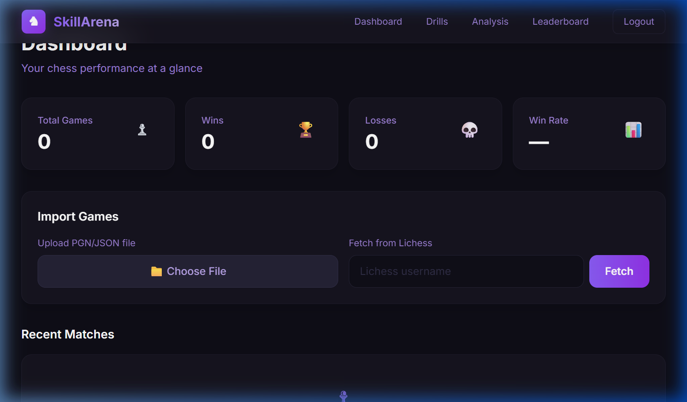

# ♟️ SkillArena



**SkillArena** is a full-stack, AI-powered chess analytics and training platform. It allows users to import their chess games, analyze their gameplay for blunders and inaccuracies, and improve their skills through personalized tactical and endgame drills based on their specific weaknesses.

## ✨ Features

*   **Game Import**: Automatically fetch recent games from Lichess or upload your own PGN/JSON files.
*   **Performance Dashboard**: Track your win rates, total games played, and view a history of your recent matches.
*   **Deep Engine Analysis**: Identify blunders, mistakes, and brilliant moves using integrated chess engine evaluations.
*   **Personalized Drills**: Practice tactical puzzles, endgame scenarios, and opening lines recommended specifically for you based on the weaknesses found in your matches.
*   **Global Leaderboard**: Compare your Elo rating and performance against other players on the platform.

## 🛠️ Tech Stack

This application is built with a modern, containerized architecture:

*   **Frontend:** React, Vite, Tailwind CSS, Zustand (State Management)
*   **Backend:** Python, FastAPI, SQLAlchemy, Alembic
*   **Database:** PostgreSQL (Partitioned for high-performance move analysis)
*   **Caching & Background Jobs:** Redis
*   **Infrastructure:** Docker & Docker Compose

## 🚀 How to Run Locally

Running SkillArena on your local machine is incredibly easy thanks to Docker. 

### Prerequisites
*   [Docker Desktop](https://www.docker.com/products/docker-desktop/) installed and running.
*   Git installed.

### Setup Instructions

1.  **Clone the repository**
    ```bash
    git clone https://github.com/saatvic008/SkillArena.git
    cd SkillArena
    ```

2.  **Start the application**
    ```bash
    docker-compose up -d --build
    ```
    *This command will download the necessary images, build the frontend and backend, initialize the PostgreSQL database, and seed it with test data.*

3.  **Access the application**
    *   **Frontend:** Open your browser and navigate to `http://localhost:3000`
    *   **Backend API Documentation (Swagger):** `http://localhost:8000/docs`

4.  **Stopping the application**
    ```bash
    docker-compose down
    ```

---
*Built by [saatvic008]*
